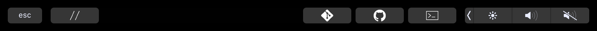

# basic touch bar for Atom

An atom package that adds a few useful buttons to the MacBook Pro touch bar.

#### Current additions:
- `editor:toggle-line-comments`
- `github:toggle-git-tab`
- `github:toggle-github-tab`
- `command-palette:toggle`
